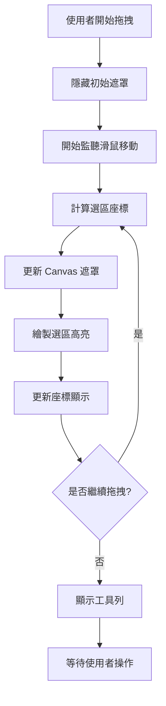

# 區域截圖視覺體驗改善計畫

## 專案概述

本計畫專注於改善 Dukshot 區域截圖功能的視覺體驗，解決目前選區內外對比度不足的問題，實現更直觀的截圖選擇體驗。

## 問題分析

### 當前實現機制
**檔案位置：** `renderer/capture.html`

1. **初始暗化層**（第19行）
   ```css
   body {
     background: rgba(0, 0, 0, 0.3);
   }
   ```

2. **遮罩覆蓋層**（第139-153行）
   ```css
   .mask-overlay {
     background: rgba(0, 0, 0, 0.7);
     z-index: 999;
   }
   ```

3. **複雜的選區挖洞效果**（第513-529行）
   - 使用 `box-shadow` 創建四個區域的暗化遮罩
   - 計算複雜的位置座標
   - 效能開銷較大

### 核心問題點

1. **對比度不足**：選區內外的視覺差異不夠明顯
2. **複雜實現**：當前的 `box-shadow` 方案計算複雜且效能較差
3. **視覺體驗**：使用者難以清楚區分選取區域和背景區域

## 技術實現方案

### 方案一：Canvas 雙層遮罩技術（推薦）

**核心概念：**
使用兩層 Canvas 實現精確的視覺控制：
- 底層 Canvas：顯示原始截圖
- 頂層 Canvas：動態繪製遮罩效果

**技術優勢：**
- 精確控制每個像素的透明度
- 更好的效能表現
- 支援複雜的視覺效果（如羽化邊緣）

### 方案二：改進的 CSS 遮罩方案

**核心概念：**
優化現有的 CSS 方案，使用 `clip-path` 替代 `box-shadow`

**技術優勢：**
- 改動最小，風險較低
- 更好的瀏覽器相容性
- 較簡單的實現邏輯

## 詳細實施計畫

### Phase 1：Canvas 遮罩系統設計

#### 1.1 新增遮罩 Canvas 元素
**修改檔案：** `renderer/capture.html`
**具體變更：**
```html
<!-- 新增遮罩 Canvas，位於截圖 Canvas 上方 -->
<canvas id="maskCanvas"></canvas>
```

**CSS 樣式定義：**
```css
#maskCanvas {
  position: absolute;
  top: 0;
  left: 0;
  pointer-events: none;
  z-index: 998;
}
```

#### 1.2 遮罩繪製邏輯實現
**核心方法：** `drawMask(selectedRegion)`

```javascript
drawMask(x, y, width, height) {
  const maskCtx = this.maskCanvas.getContext('2d');
  
  // 清除畫布
  maskCtx.clearRect(0, 0, this.maskCanvas.width, this.maskCanvas.height);
  
  // 繪製全螢幕暗化遮罩
  maskCtx.fillStyle = 'rgba(0, 0, 0, 0.6)';
  maskCtx.fillRect(0, 0, this.maskCanvas.width, this.maskCanvas.height);
  
  // 挖洞效果 - 清除選區內的遮罩
  maskCtx.globalCompositeOperation = 'destination-out';
  maskCtx.fillRect(x, y, width, height);
  
  // 重置混合模式
  maskCtx.globalCompositeOperation = 'source-over';
}
```

### Phase 2：視覺效果優化

#### 2.1 選區邊框增強
**增強選區邊界的可視性：**
```css
.selection-rect {
  border: 3px solid #00ff88;
  box-shadow: 
    0 0 0 1px rgba(0, 255, 136, 0.3),
    0 0 10px rgba(0, 255, 136, 0.2);
}
```

#### 2.2 動態對比度調整
**根據背景亮度自動調整遮罩透明度：**
```javascript
calculateOptimalMaskOpacity(imageData) {
  // 分析背景區域的平均亮度
  const brightness = this.getAverageBrightness(imageData);
  
  // 根據亮度調整遮罩透明度
  return brightness > 128 ? 0.7 : 0.5;
}
```

### Phase 3：程式碼重構

#### 3.1 重構視覺效果更新方法
**檔案：** `renderer/capture.html` (JavaScript 區域)
**方法：** `updateVisualEffects(x, y, width, height)`

**原始實現問題：**
- 使用複雜的 `box-shadow` 計算
- 效能開銷大
- 程式碼可讀性差

**新實現方案：**
```javascript
updateVisualEffects(x, y, width, height) {
  // 簡化的實現，使用 Canvas 遮罩
  if (width < 10 || height < 10) {
    this.hideMask();
    return;
  }
  
  this.showMask();
  this.drawMask(x, y, width, height);
  this.updateSelectionHighlight(x, y, width, height);
}
```

#### 3.2 效能優化
**減少重繪頻率：**
```javascript
// 使用 requestAnimationFrame 優化重繪時機
updateVisualEffectsThrottled(x, y, width, height) {
  if (this.animationFrameId) {
    cancelAnimationFrame(this.animationFrameId);
  }
  
  this.animationFrameId = requestAnimationFrame(() => {
    this.updateVisualEffects(x, y, width, height);
  });
}
```

## 實現流程圖



## 檔案修改清單

### 主要修改檔案

1. **`renderer/capture.html`**
   - 新增 `maskCanvas` 元素
   - 重構 `CaptureScreen` 類別
   - 修改 `updateVisualEffects` 方法
   - 優化 CSS 樣式定義

### 具體修改項目

#### HTML 結構調整
```html
<!-- 新增內容 -->
<canvas id="maskCanvas"></canvas>

<!-- 保持現有 -->
<canvas id="captureCanvas"></canvas>
<div class="selection-rect" id="selectionRect"></div>
```

#### CSS 樣式優化
```css
/* 移除複雜的 box-shadow 遮罩 */
.mask-overlay {
  display: none; /* 替代為 Canvas 遮罩 */
}

/* 新增 Canvas 遮罩樣式 */
#maskCanvas {
  position: absolute;
  top: 0;
  left: 0;
  pointer-events: none;
  z-index: 998;
}

/* 增強選區邊框 */
.selection-rect {
  border: 3px solid #00ff88;
  background: transparent;
  box-shadow: 
    0 0 0 1px rgba(0, 255, 136, 0.5),
    0 0 15px rgba(0, 255, 136, 0.3);
}
```

#### JavaScript 邏輯重構
```javascript
// 新增方法
initMaskCanvas() {
  this.maskCanvas = document.getElementById("maskCanvas");
  this.maskCtx = this.maskCanvas.getContext("2d");
  this.maskCanvas.width = window.screen.width;
  this.maskCanvas.height = window.screen.height;
}

// 替換原有的複雜遮罩邏輯
drawMask(x, y, width, height) {
  // Canvas 遮罩實現（如上述範例）
}
```

## 測試驗證計畫

### 測試場景

1. **不同解析度測試**
   - 1080p (1920x1080)
   - 1440p (2560x1440)  
   - 4K (3840x2160)

2. **不同背景內容測試**
   - 亮色背景（如白色文檔）
   - 暗色背景（如程式碼編輯器）
   - 混合背景（如網頁內容）

3. **效能測試**
   - 拖拽流暢度測試
   - 記憶體使用量監控
   - CPU 使用率測試

### 驗證標準

- **視覺效果**：選區內外對比度明顯，選區邊界清晰可見
- **效能表現**：拖拽過程中 FPS 保持在 30+ 以上
- **功能完整性**：所有現有功能（格線、座標、工具列）正常運作

## 實施優先序

1. **高優先級**
   - Canvas 遮罩系統實現
   - 基本視覺效果改善

2. **中優先級** 
   - 效能優化
   - 邊框樣式增強

3. **低優先級**
   - 動態對比度調整
   - 進階視覺效果

## 預期效果

實施完成後，區域截圖將具備：
- **清晰的視覺對比**：選區內保持原始亮度，選區外適度暗化
- **流暢的操作體驗**：優化的重繪機制確保拖拽順暢
- **一致的功能性**：保持所有現有功能完整可用
- **良好的效能表現**：降低 CPU 和記憶體使用量

此計畫將顯著提升 Dukshot 區域截圖功能的使用者體驗。