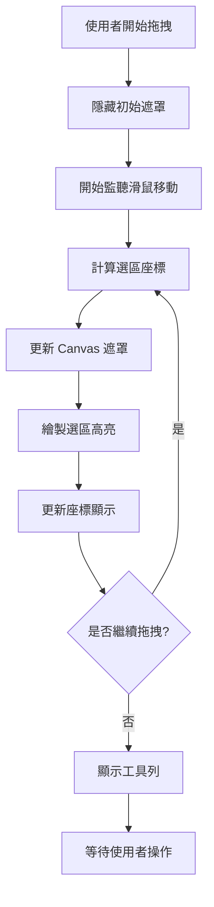
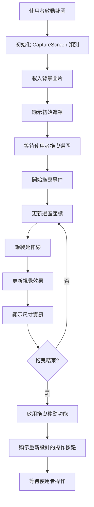
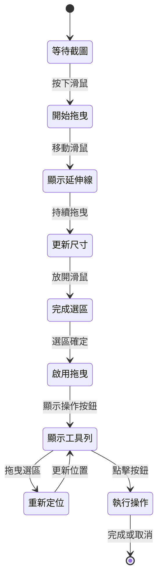

# 區域截圖視覺體驗改善計畫

## 專案概述

本計畫專注於改善 Dukshot 區域截圖功能的視覺體驗，解決目前選區內外對比度不足的問題，實現更直觀的截圖選擇體驗。

## 問題分析

### 當前實現機制
**檔案位置：** `renderer/capture.html`

1. **初始暗化層**（第19行）
   ```css
   body {
     background: rgba(0, 0, 0, 0.3);
   }
   ```

2. **遮罩覆蓋層**（第139-153行）
   ```css
   .mask-overlay {
     background: rgba(0, 0, 0, 0.7);
     z-index: 999;
   }
   ```

3. **複雜的選區挖洞效果**（第513-529行）
   - 使用 `box-shadow` 創建四個區域的暗化遮罩
   - 計算複雜的位置座標
   - 效能開銷較大

### 核心問題點

1. **對比度不足**：選區內外的視覺差異不夠明顯
2. **複雜實現**：當前的 `box-shadow` 方案計算複雜且效能較差
3. **視覺體驗**：使用者難以清楚區分選取區域和背景區域

## 技術實現方案

### 方案一：Canvas 雙層遮罩技術（推薦）

**核心概念：**
使用兩層 Canvas 實現精確的視覺控制：
- 底層 Canvas：顯示原始截圖
- 頂層 Canvas：動態繪製遮罩效果

**技術優勢：**
- 精確控制每個像素的透明度
- 更好的效能表現
- 支援複雜的視覺效果（如羽化邊緣）

### 方案二：改進的 CSS 遮罩方案

**核心概念：**
優化現有的 CSS 方案，使用 `clip-path` 替代 `box-shadow`

**技術優勢：**
- 改動最小，風險較低
- 更好的瀏覽器相容性
- 較簡單的實現邏輯

## 詳細實施計畫

### Phase 1：Canvas 遮罩系統設計

#### 1.1 新增遮罩 Canvas 元素
**修改檔案：** `renderer/capture.html`
**具體變更：**
```html
<!-- 新增遮罩 Canvas，位於截圖 Canvas 上方 -->
<canvas id="maskCanvas"></canvas>
```

**CSS 樣式定義：**
```css
#maskCanvas {
  position: absolute;
  top: 0;
  left: 0;
  pointer-events: none;
  z-index: 998;
}
```

#### 1.2 遮罩繪製邏輯實現
**核心方法：** `drawMask(selectedRegion)`

```javascript
drawMask(x, y, width, height) {
  const maskCtx = this.maskCanvas.getContext('2d');
  
  // 清除畫布
  maskCtx.clearRect(0, 0, this.maskCanvas.width, this.maskCanvas.height);
  
  // 繪製全螢幕暗化遮罩
  maskCtx.fillStyle = 'rgba(0, 0, 0, 0.6)';
  maskCtx.fillRect(0, 0, this.maskCanvas.width, this.maskCanvas.height);
  
  // 挖洞效果 - 清除選區內的遮罩
  maskCtx.globalCompositeOperation = 'destination-out';
  maskCtx.fillRect(x, y, width, height);
  
  // 重置混合模式
  maskCtx.globalCompositeOperation = 'source-over';
}
```

### Phase 2：視覺效果優化

#### 2.1 選區邊框增強
**增強選區邊界的可視性：**
```css
.selection-rect {
  border: 3px solid #00ff88;
  box-shadow: 
    0 0 0 1px rgba(0, 255, 136, 0.3),
    0 0 10px rgba(0, 255, 136, 0.2);
}
```

#### 2.2 動態對比度調整
**根據背景亮度自動調整遮罩透明度：**
```javascript
calculateOptimalMaskOpacity(imageData) {
  // 分析背景區域的平均亮度
  const brightness = this.getAverageBrightness(imageData);
  
  // 根據亮度調整遮罩透明度
  return brightness > 128 ? 0.7 : 0.5;
}
```

### Phase 3：程式碼重構

#### 3.1 重構視覺效果更新方法
**檔案：** `renderer/capture.html` (JavaScript 區域)
**方法：** `updateVisualEffects(x, y, width, height)`

**原始實現問題：**
- 使用複雜的 `box-shadow` 計算
- 效能開銷大
- 程式碼可讀性差

**新實現方案：**
```javascript
updateVisualEffects(x, y, width, height) {
  // 簡化的實現，使用 Canvas 遮罩
  if (width < 10 || height < 10) {
    this.hideMask();
    return;
  }
  
  this.showMask();
  this.drawMask(x, y, width, height);
  this.updateSelectionHighlight(x, y, width, height);
}
```

#### 3.2 效能優化
**減少重繪頻率：**
```javascript
// 使用 requestAnimationFrame 優化重繪時機
updateVisualEffectsThrottled(x, y, width, height) {
  if (this.animationFrameId) {
    cancelAnimationFrame(this.animationFrameId);
  }
  
  this.animationFrameId = requestAnimationFrame(() => {
    this.updateVisualEffects(x, y, width, height);
  });
}
```

## 實現流程圖



## 檔案修改清單

### 主要修改檔案

1. **`renderer/capture.html`**
   - 新增 `maskCanvas` 元素
   - 重構 `CaptureScreen` 類別
   - 修改 `updateVisualEffects` 方法
   - 優化 CSS 樣式定義

### 具體修改項目

#### HTML 結構調整
```html
<!-- 新增內容 -->
<canvas id="maskCanvas"></canvas>

<!-- 保持現有 -->
<canvas id="captureCanvas"></canvas>
<div class="selection-rect" id="selectionRect"></div>
```

#### CSS 樣式優化
```css
/* 移除複雜的 box-shadow 遮罩 */
.mask-overlay {
  display: none; /* 替代為 Canvas 遮罩 */
}

/* 新增 Canvas 遮罩樣式 */
#maskCanvas {
  position: absolute;
  top: 0;
  left: 0;
  pointer-events: none;
  z-index: 998;
}

/* 增強選區邊框 */
.selection-rect {
  border: 3px solid #00ff88;
  background: transparent;
  box-shadow: 
    0 0 0 1px rgba(0, 255, 136, 0.5),
    0 0 15px rgba(0, 255, 136, 0.3);
}
```

#### JavaScript 邏輯重構
```javascript
// 新增方法
initMaskCanvas() {
  this.maskCanvas = document.getElementById("maskCanvas");
  this.maskCtx = this.maskCanvas.getContext("2d");
  this.maskCanvas.width = window.screen.width;
  this.maskCanvas.height = window.screen.height;
}

// 替換原有的複雜遮罩邏輯
drawMask(x, y, width, height) {
  // Canvas 遮罩實現（如上述範例）
}
```

## 測試驗證計畫

### 測試場景

1. **不同解析度測試**
   - 1080p (1920x1080)
   - 1440p (2560x1440)  
   - 4K (3840x2160)

2. **不同背景內容測試**
   - 亮色背景（如白色文檔）
   - 暗色背景（如程式碼編輯器）
   - 混合背景（如網頁內容）

3. **效能測試**
   - 拖拽流暢度測試
   - 記憶體使用量監控
   - CPU 使用率測試

### 驗證標準

- **視覺效果**：選區內外對比度明顯，選區邊界清晰可見
- **效能表現**：拖拽過程中 FPS 保持在 30+ 以上
- **功能完整性**：所有現有功能（格線、座標、工具列）正常運作

## 實施優先序

1. **高優先級**
   - Canvas 遮罩系統實現
   - 基本視覺效果改善

2. **中優先級** 
   - 效能優化
   - 邊框樣式增強

3. **低優先級**
   - 動態對比度調整
   - 進階視覺效果

## 預期效果

實施完成後，區域截圖將具備：
- **清晰的視覺對比**：選區內保持原始亮度，選區外適度暗化
- **流暢的操作體驗**：優化的重繪機制確保拖拽順暢
- **一致的功能性**：保持所有現有功能完整可用
- **良好的效能表現**：降低 CPU 和記憶體使用量

此計畫將顯著提升 Dukshot 區域截圖功能的使用者體驗。

---

# UI/UX 進階改善計畫

## 專案概述

本進階改善計畫旨在進一步提升 Dukshot 截圖工具的使用體驗，新增三個主要功能模組：選區延伸線、尺寸標示與拖曳功能、操作按鈕重新設計。這些改善將讓截圖操作更加直觀、專業且具有現代化的視覺設計。

## Software Design Document (SDD)

### 1. 技術架構設計

#### 1.1 整體系統架構



#### 1.2 模組化設計

**核心模組結構：**
- `ExtensionLines` - 延伸線繪製模組
- `DimensionDisplay` - 尺寸標示模組
- `SelectionDragger` - 拖曳移動模組
- `ModernToolbar` - 現代化工具列模組
- `IconManager` - Material Design 圖標管理模組

### 2. UI/UX設計原則

#### 2.1 視覺設計原則
- **一致性**：所有新功能採用統一的視覺語言
- **可用性**：優先考慮使用者操作的便利性
- **現代感**：採用 Material Design 風格圖標
- **專業感**：提供類似專業截圖軟體的體驗

#### 2.2 互動設計原則
- **即時反饋**：所有操作提供即時視覺回饋
- **容錯性**：支援操作的撤銷和重新定位
- **效率性**：減少不必要的點擊和操作步驟

### 3. 各功能實現方案

#### 3.1 選區延伸線功能

**技術實現：**
```javascript
class ExtensionLines {
  constructor(maskCanvas, maskCtx) {
    this.maskCanvas = maskCanvas;
    this.maskCtx = maskCtx;
    this.lineColor = 'rgba(255, 255, 255, 0.8)';
    this.lineWidth = 1;
    this.dashPattern = [5, 3];
  }

  drawExtensionLines(x, y, width, height) {
    this.maskCtx.save();
    this.maskCtx.globalCompositeOperation = 'source-over';
    this.maskCtx.strokeStyle = this.lineColor;
    this.maskCtx.lineWidth = this.lineWidth;
    this.maskCtx.setLineDash(this.dashPattern);

    // 繪製四條延伸線到螢幕邊緣
    // 頂部延伸線
    this.maskCtx.beginPath();
    this.maskCtx.moveTo(x, 0);
    this.maskCtx.lineTo(x, y);
    this.maskCtx.moveTo(x + width, 0);
    this.maskCtx.lineTo(x + width, y);
    
    // 底部延伸線
    this.maskCtx.moveTo(x, y + height);
    this.maskCtx.lineTo(x, this.maskCanvas.height);
    this.maskCtx.moveTo(x + width, y + height);
    this.maskCtx.lineTo(x + width, this.maskCanvas.height);
    
    // 左右延伸線
    this.maskCtx.moveTo(0, y);
    this.maskCtx.lineTo(x, y);
    this.maskCtx.moveTo(x + width, y);
    this.maskCtx.lineTo(this.maskCanvas.width, y);
    this.maskCtx.moveTo(0, y + height);
    this.maskCtx.lineTo(x, y + height);
    this.maskCtx.moveTo(x + width, y + height);
    this.maskCtx.lineTo(this.maskCanvas.width, y + height);
    
    this.maskCtx.stroke();
    this.maskCtx.restore();
  }
}
```

**設計特色：**
- 虛線樣式，視覺上不干擾主要內容
- 半透明白色，在各種背景下都有良好的對比度
- 延伸至螢幕邊緣，提供精確的對齊參考

#### 3.2 尺寸標示與拖曳功能

**尺寸標示設計：**
```javascript
class DimensionDisplay {
  constructor() {
    this.displayElement = null;
    this.isDragging = false;
    this.dragOffset = { x: 0, y: 0 };
  }

  createDimensionDisplay(x, y, width, height) {
    if (!this.displayElement) {
      this.displayElement = document.createElement('div');
      this.displayElement.className = 'dimension-display';
      document.body.appendChild(this.displayElement);
    }

    this.displayElement.innerHTML = `
      <div class="dimension-text">w: ${width} h: ${height}</div>
    `;
    
    // 定位在選區右上角
    this.displayElement.style.left = (x + width + 10) + 'px';
    this.displayElement.style.top = (y - 10) + 'px';
    this.displayElement.style.display = 'block';
  }
}
```

**拖曳移動功能：**
```javascript
class SelectionDragger {
  constructor(selectionRect) {
    this.selectionRect = selectionRect;
    this.isDragging = false;
    this.dragStartPos = { x: 0, y: 0 };
    this.setupDragHandlers();
  }

  setupDragHandlers() {
    this.selectionRect.style.cursor = 'move';
    this.selectionRect.addEventListener('mousedown', this.onDragStart.bind(this));
    document.addEventListener('mousemove', this.onDragMove.bind(this));
    document.addEventListener('mouseup', this.onDragEnd.bind(this));
  }

  onDragStart(e) {
    e.preventDefault();
    this.isDragging = true;
    this.dragStartPos = {
      x: e.clientX - this.selectionRect.offsetLeft,
      y: e.clientY - this.selectionRect.offsetTop
    };
    this.selectionRect.style.transition = 'none';
  }

  onDragMove(e) {
    if (!this.isDragging) return;
    
    const newX = e.clientX - this.dragStartPos.x;
    const newY = e.clientY - this.dragStartPos.y;
    
    // 邊界檢查
    const maxX = window.innerWidth - this.selectionRect.offsetWidth;
    const maxY = window.innerHeight - this.selectionRect.offsetHeight;
    
    const constrainedX = Math.max(0, Math.min(newX, maxX));
    const constrainedY = Math.max(0, Math.min(newY, maxY));
    
    this.selectionRect.style.left = constrainedX + 'px';
    this.selectionRect.style.top = constrainedY + 'px';
    
    // 更新相關視覺效果
    this.updateVisualEffects(constrainedX, constrainedY);
  }
}
```

#### 3.3 操作按鈕重新設計

**Material Design Icons 整合：**
```html
<!-- 新的工具列設計 -->
<div class="capture-toolbar modern" id="captureToolbar">
  <div class="toolbar-grid">
    <button class="toolbar-btn" id="saveJpgBtn" data-tooltip="儲存為 JPG">
      <svg class="icon"><use href="#icon-image"/></svg>
    </button>
    <button class="toolbar-btn" id="savePngBtn" data-tooltip="儲存為 PNG">
      <svg class="icon"><use href="#icon-file-image"/></svg>
    </button>
    <button class="toolbar-btn" id="copyBtn" data-tooltip="複製到剪貼簿">
      <svg class="icon"><use href="#icon-copy"/></svg>
    </button>
    <button class="toolbar-btn" id="uploadBtn" data-tooltip="上傳到雲端">
      <svg class="icon"><use href="#icon-cloud-upload"/></svg>
    </button>
    <button class="toolbar-btn cancel" id="cancelBtn" data-tooltip="取消截圖">
      <svg class="icon"><use href="#icon-x"/></svg>
    </button>
  </div>
</div>
```

**CSS 樣式設計：**
```css
.capture-toolbar.modern {
  background: rgba(255, 255, 255, 0.98);
  backdrop-filter: blur(10px);
  border-radius: 12px;
  padding: 8px;
  box-shadow: 0 8px 32px rgba(0, 0, 0, 0.2);
  border: 1px solid rgba(255, 255, 255, 0.3);
}

.toolbar-grid {
  display: flex;
  gap: 4px;
  align-items: center;
}

.toolbar-btn {
  width: 44px;
  height: 44px;
  border: none;
  border-radius: 8px;
  background: transparent;
  color: #666;
  cursor: pointer;
  transition: all 0.2s cubic-bezier(0.4, 0, 0.2, 1);
  display: flex;
  align-items: center;
  justify-content: center;
  position: relative;
}

.toolbar-btn:hover {
  background: rgba(74, 144, 226, 0.1);
  color: #4a90e2;
  transform: translateY(-1px);
}

.toolbar-btn:active {
  transform: translateY(0);
  background: rgba(74, 144, 226, 0.2);
}

.toolbar-btn.cancel:hover {
  background: rgba(220, 38, 127, 0.1);
  color: #dc267f;
}

.icon {
  width: 20px;
  height: 20px;
  stroke-width: 2;
}
```

### 4. 介面互動流程



## Implementation Plan (TODO List)

### Phase 1: 基礎設施建置 (預估 2-3 天)
1. **加入 Material Design Icons 依賴**
   - 下載 Material Design Icons SVG sprite
   - 整合到專案資源中
   - 建立圖標組件系統

2. **建立模組化架構**
   - 創建 `ExtensionLines` 類別
   - 創建 `DimensionDisplay` 類別
   - 創建 `SelectionDragger` 類別
   - 創建 `ModernToolbar` 類別

### Phase 2: 核心功能開發 (預估 4-5 天)
3. **實作選區延伸線功能**
   - 在 [`CaptureScreen`](renderer/capture.html:269) 類別中整合延伸線繪製
   - 修改 [`updateVisualEffects`](renderer/capture.html:531) 方法
   - 加入延伸線的顯示/隱藏邏輯

4. **實作尺寸標示功能**
   - 重構 [`updateSelection`](renderer/capture.html:507) 方法
   - 改善尺寸顯示的位置算法
   - 加入更美觀的尺寸標示樣式

5. **實作拖曳移動功能**
   - 為選區元素加入拖曳事件監聽器
   - 實現邊界檢查和約束邏輯
   - 確保拖曳過程中視覺效果同步更新

### Phase 3: UI 重新設計 (預估 3-4 天)
6. **重新設計操作按鈕**
   - 替換現有的 emoji 按鈕為 SVG 圖標
   - 實現橫向 flex 布局
   - 加入 hover 和 active 動畫效果
   - 整合 tooltip 提示系統

7. **優化視覺設計**
   - 調整工具列的背景和邊框樣式
   - 實現 backdrop-filter 模糊效果
   - 加入微互動動畫

### Phase 4: 整合與優化 (預估 2-3 天)
8. **功能整合測試**
   - 確保三個新功能協同工作
   - 優化效能，避免過度重繪
   - 處理邊界情況和錯誤狀態

9. **響應式適配**
   - 不同解析度下的適配測試
   - 高 DPI 螢幕的圖標清晰度優化

## Testing Strategy

### 1. 單元測試方法

**測試框架選擇：** Jest + Electron Testing Utils

**核心測試項目：**
```javascript
// 選區延伸線測試
describe('ExtensionLines', () => {
  test('應該正確繪製四條延伸線', () => {
    const canvas = createMockCanvas();
    const extensionLines = new ExtensionLines(canvas, canvas.getContext('2d'));
    extensionLines.drawExtensionLines(100, 100, 200, 150);
    expect(mockCtx.beginPath).toHaveBeenCalled();
    expect(mockCtx.stroke).toHaveBeenCalled();
  });
});

// 拖曳功能測試
describe('SelectionDragger', () => {
  test('應該正確處理邊界約束', () => {
    const dragger = new SelectionDragger(mockElement);
    const result = dragger.constrainPosition(-50, -50, 100, 100);
    expect(result.x).toBe(0);
    expect(result.y).toBe(0);
  });
});
```

### 2. 視覺測試項目

**自動化視覺回歸測試：**
- 使用 Playwright 進行螢幕截圖比較
- 測試不同解析度下的延伸線顯示
- 驗證拖曳過程中的視覺回饋
- 檢查工具列在各種位置的顯示效果

**測試場景：**
- 1920x1080 解析度下的標準測試
- 4K 解析度下的高 DPI 測試
- 多螢幕環境下的邊界處理測試

### 3. 使用者體驗測試流程

**測試用戶群：**
- 內部開發團隊成員
- 設計師和 UI/UX 專業人員
- 一般使用者代表

**測試任務：**
1. 完成一次完整的區域截圖操作
2. 使用拖曳功能重新定位選區
3. 嘗試每個工具列按鈕的功能
4. 在不同背景（亮/暗）下測試延伸線可見性

**評估標準：**
- 操作直觀性評分 (1-5 分)
- 視覺美觀度評分 (1-5 分)
- 功能完整性檢查 (通過/未通過)

### 4. 跨瀏覽器相容性測試

**測試環境：**
- Windows 11 + 不同版本 Chrome/Edge
- macOS + Safari/Chrome
- Linux + Chrome/Firefox

**重點測試項目：**
- SVG 圖標的渲染一致性
- backdrop-filter 的瀏覽器支援
- Canvas 繪製效能差異
- 拖曳事件的處理差異

## Git Strategy

### 1. 分支管理策略

**主要分支：**
- `main` - 生產就緒代碼
- `develop` - 開發整合分支

**功能分支：**
- `feature/extension-lines` - 選區延伸線功能
- `feature/dimension-drag` - 尺寸標示與拖曳功能
- `feature/modern-toolbar` - 操作按鈕重新設計
- `feature/material-icons` - Material Design Icons 整合

### 2. 提交策略

**提交信息格式：**
```
<type>(<scope>): <subject>

<body>

<footer>
```

**類型定義：**
- `feat`: 新功能
- `fix`: 錯誤修復
- `style`: 樣式調整
- `refactor`: 代碼重構
- `test`: 測試相關
- `docs`: 文檔更新

**範例提交：**
```
feat(capture): 加入選區延伸線功能

- 實作 ExtensionLines 類別
- 整合到 CaptureScreen 主要流程
- 加入延伸線的顯示/隱藏邏輯

Closes #123
```

### 3. Code Review 檢查清單

**功能完整性：**
- [ ] 新功能按照設計規範實現
- [ ] 錯誤處理機制完備
- [ ] 邊界條件處理正確

**程式品質：**
- [ ] 代碼風格符合專案規範
- [ ] 適當的註釋和文檔
- [ ] 無明顯的效能問題

**測試覆蓋：**
- [ ] 單元測試覆蓋新功能
- [ ] 整合測試通過
- [ ] 視覺測試無回歸

### 4. 版本標記建議

**版本號規則：** 遵循 Semantic Versioning (SemVer)

**發布計劃：**
- `v1.1.0-alpha.1` - Phase 1 完成後的內測版本
- `v1.1.0-beta.1` - Phase 2-3 完成後的公測版本
- `v1.1.0` - 正式發布版本

**標記命令：**
```bash
git tag -a v1.1.0 -m "發布 UI/UX 進階改善版本

新功能：
- 選區延伸線輔助對齊
- 尺寸標示與拖曳重定位
- Material Design 風格操作按鈕
- 改善的視覺回饋效果"

git push origin v1.1.0
```

## 技術依賴更新

### Material Design Icons 整合

**Package.json 更新：**
```json
{
  "devDependencies": {
    "@mdi/svg": "^7.4.47",
    "svg-sprite-generator": "^0.8.0"
  }
}
```

**圖標構建腳本：**
```json
{
  "scripts": {
    "build:icons": "node scripts/build-icon-sprite.js",
    "prebuild": "npm run build:icons"
  }
}
```

## 預期效果與成果

完成所有改善後，Dukshot 截圖工具將具備：

### 視覺改善
- **專業的輔助線系統**：提供精確的對齊參考
- **清晰的尺寸顯示**：即時顯示選區大小資訊
- **現代化的操作介面**：採用 Material Design 設計語言

### 操作體驗
- **直觀的拖曳操作**：可重新定位選區而無需重新選擇
- **一致的圖標語言**：專業的 SVG 圖標提升品牌形象
- **流暢的動畫效果**：提供即時且舒適的視覺回饋

### 技術提升
- **模組化的架構設計**：易於維護和擴展
- **完整的測試覆蓋**：確保功能穩定性
- **標準化的開發流程**：提升團隊協作效率

這些改善將讓 Dukshot 從基礎截圖工具提升為專業級的螢幕捕獲軟體，為使用者提供更加精確、美觀且高效的截圖體驗。